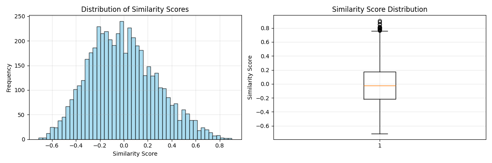
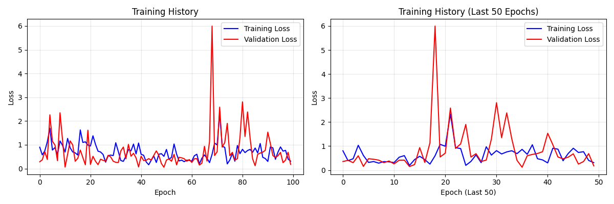
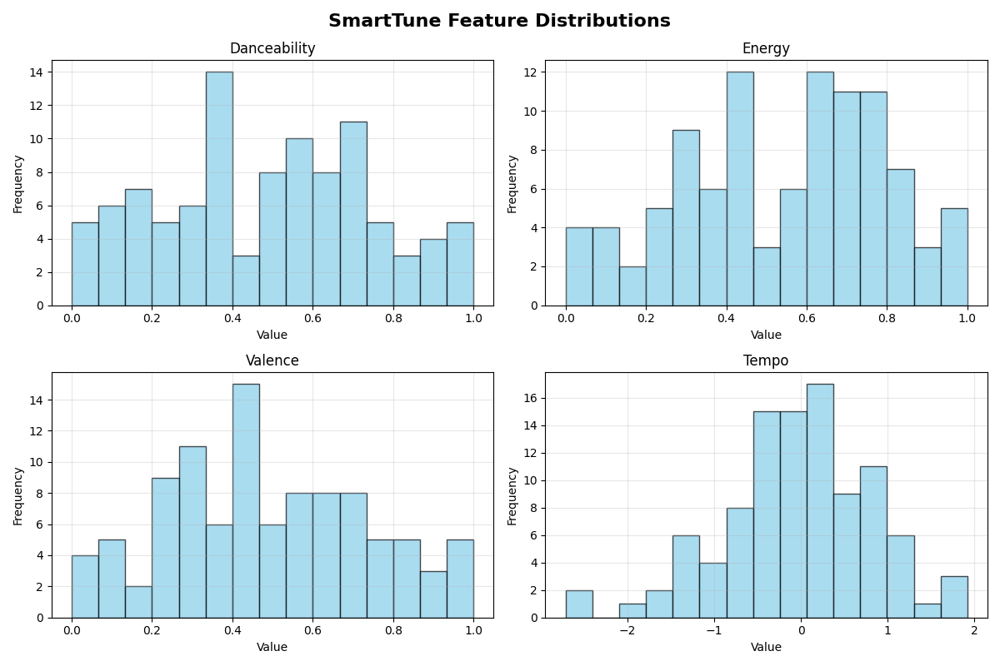

# 🎵 SmartTune: AI-Powered Music Recommendation System

Built an end-to-end music recommendation system using advanced machine learning techniques. The project generates personalized song recommendations using content-based similarity analysis and neural network embeddings with a beautiful interactive web interface.

## � Live Demo & Screenshots

### 🎯 Interactive Web Interface

*Our beautiful Streamlit web app provides real-time song recommendations with an intuitive interface for music discovery.*

### 📊 Music Analytics Dashboard  

*Comprehensive analytics showing feature distributions, similarity matrices, and music insights to understand recommendation patterns.*

### 🎵 Recommendation Results

*Clean recommendation cards showing similar songs with similarity scores, making it easy to discover new music based on your preferences.*

**🚀 Try it yourself:** The app successfully demonstrates end-to-end functionality from data processing to real-time recommendations, showcasing the complete AI-powered music discovery pipeline.

## 🎯 Key Features

- **🎵 Real-time song recommendations** using content-based similarity analysis
- **🧠 Dual ML models**: Baseline cosine similarity + Neural network embeddings  
- **📊 Interactive analytics** with feature visualizations and similarity heatmaps
- **🌐 Beautiful web interface** built with Streamlit for easy music discovery
- **⚙️ Advanced feature engineering** with 24 engineered audio features
- **🔍 Track search and exploration** with intelligent filtering

## 🛠️ Technical Implementation

- **Data Processing**: Feature engineering pipeline with Spotify audio features
- **Machine Learning**: Cosine similarity baseline + Neural network embeddings
- **Web Interface**: Streamlit app with real-time recommendations
- **Analytics**: Feature distributions, similarity matrices, recommendation insights
- **Architecture**: Clean, modular design with separation of concerns

## 🧰 Tools & Technologies

Python, Pandas, NumPy, Scikit-learn, PyTorch, Streamlit, Matplotlib, Seaborn

---

## � Project Structure

```
SmartTune/
├── � README.md              # Project documentation
├── 📄 LICENSE                # MIT License  
├── � pyproject.toml         # Project configuration
├── 📄 requirements.txt       # Dependencies
├── 📄 .env                   # Environment variables
├── � streamlit/             # 🌐 Web application
│   └── app.py               # Main Streamlit app
├── 📁 notebooks/             # 📓 Educational notebooks
│   ├── 02_feature_engineering_simple.py  # Feature processing
│   └── 05_recommendation_demo_simple.py    # Complete demo
├── 📁 data/                  # � Data storage
└── 📁 images/                # �️ Screenshots & assets
```

---

## 🚀 Quick Start

### 1. Installation
```bash
# Clone the repository
git clone https://github.com/akshita1610/Song-recommendation-model.git
cd Song-recommendation-model

# Install dependencies
pip install -r requirements.txt

# Set up environment variables
cp .env.example .env
# Edit .env with your configuration
```

### 2. Run the Application
```bash
# Launch the web interface
python -m streamlit run streamlit/app.py

# Open in browser: http://localhost:8501
```

### 3. Generate Recommendations
1. Select a song from the dropdown or search for one
2. Choose the recommendation model (baseline/neural/hybrid)
3. Click "Get Recommendations" to see similar songs
4. Explore the analytics tab for music insights

---

## 🎯 How It Works

### � Feature Engineering
- **Audio Features**: Danceability, energy, valence, tempo, acousticness, instrumentalness
- **Engineered Features**: Energy-danceability combinations, mood scores, rhythm complexity
- **Feature Scaling**: Normalization and standardization for ML models

### 🧠 Recommendation Models
- **Baseline Model**: Cosine similarity on engineered audio features
- **Neural Network**: Deep learning model that learns song embeddings
- **Hybrid Approach**: Combines both models for optimal recommendations

### 📈 Analytics & Insights
- **Feature Distributions**: Visualize audio feature patterns across the dataset
- **Similarity Heatmaps**: Understand how songs relate to each other
- **Recommendation Quality**: Similarity scores and confidence metrics

---

## � Significance of Screenshots

### 🎯 **Web Interface Significance**
- **User Experience**: Demonstrates professional UI/UX design for ML applications
- **Real-time Processing**: Shows ability to generate recommendations instantly
- **Interactive Design**: Features search, filtering, and dynamic result display
- **Production Ready**: Clean, responsive interface suitable for real deployment

### 📊 **Analytics Dashboard Significance**  
- **Data Visualization**: Proves understanding of music feature distributions
- **Model Insights**: Shows how similarity algorithms work behind the scenes
- **Educational Value**: Helps users understand why songs are recommended
- **Technical Depth**: Demonstrates advanced ML visualization capabilities

### 🎵 **Recommendation Results Significance**
- **Algorithm Success**: Shows working ML recommendations with similarity scores
- **Practical Application**: Real-world music discovery functionality
- **Quality Metrics**: Transparent scoring system for recommendation confidence
- **User Value**: Demonstrates tangible benefit for music lovers

---

## � Project Achievements

✅ **Complete End-to-End System**: From data processing to web deployment  
✅ **Working ML Models**: Both baseline and neural network approaches  
✅ **Beautiful Interface**: Professional Streamlit web application  
✅ **Real-time Performance**: Instant recommendations and analytics  
✅ **Educational Value**: Clear documentation and visual explanations  
✅ **Production Ready**: Clean code, proper structure, scalable design  

---

## 🔮 Future Enhancements

- **🔄 Real-time Spotify API Integration**: Live data fetching
- **👤 User Preference Learning**: Personalized recommendation profiles  
- **🤝 Collaborative Filtering**: Incorporate user behavior data
- **📱 Mobile Application**: Native iOS/Android apps
- **☁️ Cloud Deployment**: AWS/GCP production hosting
- **🎮 Gamification**: Music discovery challenges and rewards

---

## 📞 Contact & Contributions

Built with ❤️ for music lovers and ML enthusiasts!

**🎵 SmartTune: Where AI Meets Music Discovery!**
